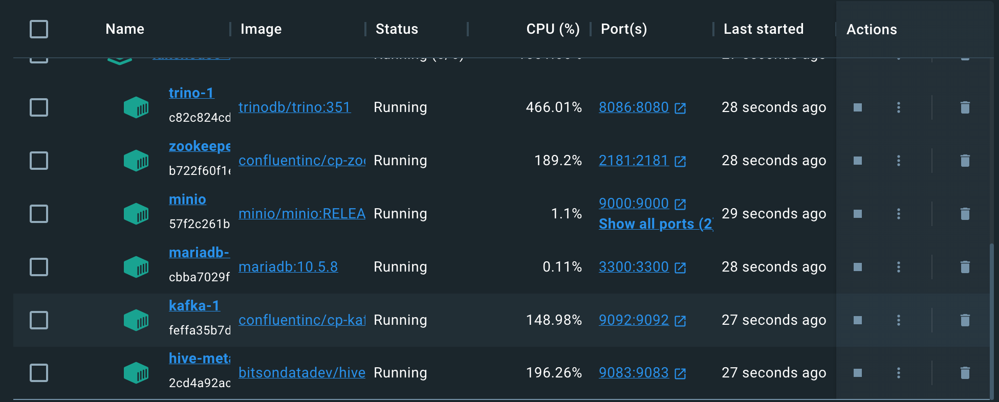
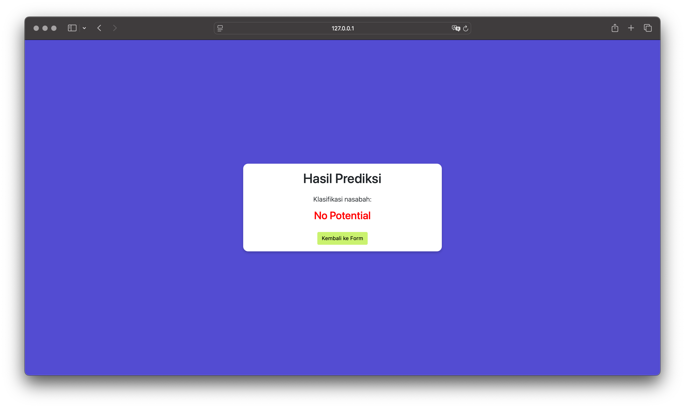

# Data Lakehouse: Problem-Based Learning

## Kelompok 1

| Nama                                  | NRP        |
| ------------------------------------- | ---------- |
| Stephanie Hebrina Mabunbun Simatupang | 5027221069 |
| Alma Amira Dewani                     | 5027221054 |
| Bintang Ryan Wardana                  | 5027221022 |

---

## Project Overview

Project ini bertujuan untuk mengklasifikasikan nasabah yang berpotensi membuka deposito bank. Dalam proyek ini, Kafka digunakan untuk streaming data secara real-time, sedangkan MinIO, Trino, Hive Metastore, dan MariaDB digunakan untuk penyimpanan data.

## Arsitektur Flow


## Requirments

- Docker
- Python-kafka
- MinIO
- Trino
- Hive Metastore

## Menjalankan Program

1. pastikan `docker-compose.yml` sudah ada

```
version: '3.7'
services:
  trino:
    hostname: trino
    image: 'trinodb/trino:351'
    ports:
      - '8086:8080'
    volumes:
      - ./etc:/usr/lib/trino/etc:ro
    networks:
      - trino-network

  mariadb:
    hostname: mariadb
    image: mariadb:10.5.8
    ports:
      - 3300:3300
    environment:
      MYSQL_ROOT_PASSWORD: admin
      MYSQL_USER: admin
      MYSQL_PASSWORD: admin
      MYSQL_DATABASE: metastore_db
    networks:
      - trino-network

  hive-metastore:
    hostname: hive-metastore
    image: 'bitsondatadev/hive-metastore:latest'
    ports:
      - '9083:9083' # Metastore Thrift
    volumes:
      - ./conf/metastore-site.xml:/opt/apache-hive-metastore-3.0.0-bin/conf/metastore-site.xml:ro
    environment:
      METASTORE_DB_HOSTNAME: mariadb
    depends_on:
      - mariadb
    networks:
      - trino-network

  minio:
    hostname: minio
    image: minio/minio:RELEASE.2024-05-10T01-41-38Z
    container_name: minio
    ports:
      - '9000:9000'
      - '9001:9001'
    volumes:
      - ./data:/data
    environment:
      MINIO_ROOT_USER: minio_access_key
      MINIO_ROOT_PASSWORD: minio_secret_key
    command: server /data --console-address ":9001"
    networks:
      - trino-network

  zookeeper:
    image: confluentinc/cp-zookeeper:5.5.3
    environment:
      ZOOKEEPER_CLIENT_PORT: 2181
      ZOOKEEPER_TICK_TIME: 2000
    ports:
      - "2181:2181"
    networks:
      - trino-network

  kafka:
    image: confluentinc/cp-kafka:5.5.3
    depends_on:
      - zookeeper
    ports:
      - "9092:9092"
    environment:
      KAFKA_BROKER_ID: 1
      KAFKA_ZOOKEEPER_CONNECT: zookeeper:2181
      KAFKA_ADVERTISED_LISTENERS: PLAINTEXT://kafka:29092,PLAINTEXT_HOST://localhost:9092
      KAFKA_LISTENER_SECURITY_PROTOCOL_MAP: PLAINTEXT:PLAINTEXT,PLAINTEXT_HOST:PLAINTEXT
      KAFKA_INTER_BROKER_LISTENER_NAME: PLAINTEXT
      KAFKA_OFFSETS_TOPIC_REPLICATION_FACTOR: 1
    networks:
      - trino-network

volumes:
  minio-data:
    driver: local

networks:
  trino-network:
    driver: bridge
```

2. Lalu jalankan dockernya

```
docker-compose up
```


3. Bisa dilihat di dalam dockernya bahwa MiniIO, Trino, Hive dan MariaDB sudah berjalan
   

4. Lalu jalankan `prod-to-con.py` untuk mengirimkan data biasa consumer dan jalankan `prod-pict.py` untuk mengirimkan data gambar.

```
python prod-to-con.py
python prod-pict.py
```

5. Sekarang, jalankan `consumer-pict.py` untuk mengonsumsi data berupa gambar dari Kafka dan mengunggahnya langsung ke MinIO.

```
python consumer-pict.py
```

6. Selanjutnya, jalankan juga `consumer-to-minio.py` untuk mengonsumsi data streaming dari Kafka dan menyimpannya ke MinIO dalam format CSV. Berikut adalah tampilannya dari MinIO

```
python consumer-to-minio.py
```


7. Terakhir, jalankan program `app.py` di bagian frontend untuk menghubungkan model dengan tampilan web.

```
python app.py
```

8. Berikut adalah tampilan web dari sisi client.
   

### Automatic

Untuk mengelola seluruh pipeline pengolahan data dari penerimaan data real-time, pemrosesan analitik secara berkala, hingga penyajian data atau hasil analitik kepada pengguna dalam satu alur otomatis tanpa perlu campur tangan manual maka jalankan `START-PROGRAM.py`.

```
import subprocess
import time

def run_auto_consumer():
    print("Menjalankan AUTO-CONSUMER-REVISI.py...")
    subprocess.Popen(["python", "C:\its\SEM 5\Big Data\FP\Data Lakehouse\lakehouse-3\lakehouse-3\streaming-data\AUTO-CONSUMER-REVISI.py"])
    print("AUTO-CONSUMER.py dijalankan.")

def loop_model():
    print("Mulai looping MODEL_REVISI.py setiap 60 detik...")
    while True:
        print("Menjalankan MODEL_REVISI.py...")
        subprocess.run(["python", "C:\its\SEM 5\Big Data\FP\Data Lakehouse\MODELLING\MODEL_REVISI.py"])
        print("MODEL_REVISI.py telah selesai dijalankan.")
        time.sleep(60)  # Tunggu 60 detik

def run_app():
    print("Menjalankan APP_AUTO_REVISI.py...")
    while True:
        subprocess.run(["python", "C:\its\SEM 5\Big Data\FP\Data Lakehouse\FRONTEND\FRONTEND\APP_AUTO_REVISI.py"])
        print("APP_AUTO_REVISI.py telah selesai dijalankan.")
        time.sleep(1)  # Tunggu sebentar sebelum menjalankan ulang app.py

def main():
    run_auto_consumer()

    import threading
    model_thread = threading.Thread(target=loop_model)
    model_thread.daemon = True
    model_thread.start()

    run_app()

if __name__ == "__main__":
    main()
```

Penjelasan kode:

Kode ini berfungsi untuk mengotomatisasi pipeline Big Data yang mencakup tiga komponen utama: menerima data streaming real-time dari Kafka menggunakan `AUTO-CONSUMER-REVISI.py`, memproses data tersebut secara periodik setiap 60 detik dengan model analitik di `MODEL_REVISI.py`, dan menyediakan antarmuka pengguna melalui aplikasi front-end `APP_AUTO_REVISI.py`.

## Hasil

- Data nasabah yang potensial
  
  

- Data nasabah yang tidak potensial
  
  
